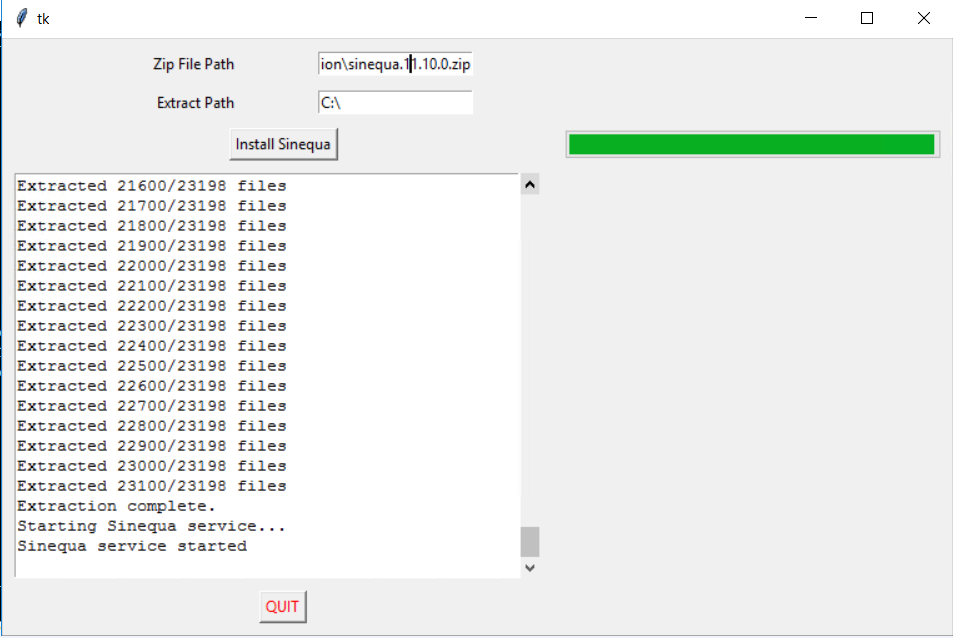

# Sinequa Installation Script

This script provides a GUI for installing Sinequa from a .zip archive. The installation steps involve stopping the Sinequa service, extracting the files from the archive, and then starting the service again.It can be used for updating the sinequa version on different servers.

## Prerequisites

Before you can run this script, you need to have Python 3 installed. If you don't have Python 3, you can download it from the [official Python website](https://www.python.org/downloads/).

This script requires the following Python packages:

- tkinter
- zipfile

These packages are part of the standard library for Python 3, so you don't need to install them separately.

## How to Run

Follow these steps to run the script:

1. Open a command prompt.

2. Navigate to the directory where the script is located. For example:

cd C:\path\to\script\directory

3. Run the script with Python. For example:
   - python SinequaInstallationScript.py
     The script will open a GUI where you can enter the paths for the .zip file and the directory where you want to extract the files. After entering these paths, click the "Install Sinequa" button to start the installation.

Please note that the script should be run with administrator privileges to be able to start and stop services.

## Creating a Batch File:

To run this script with administrator privileges, you can create a batch file. Here is a sample batch file:

- python sinequaPythonInstall.py

Save this as a .bat file, replacing C:\path\to\script\directory with the path to the directory where your Python script is located.

To run the batch file as an administrator, right-click the .bat file and select "Run as administrator".

## Troubleshooting

If you encounter any issues while running this script, please make sure you have the correct permissions to stop and start services, and to read from and write to the specified directories. If you continue to have problems, please check the error messages for more details on what went wrong.
